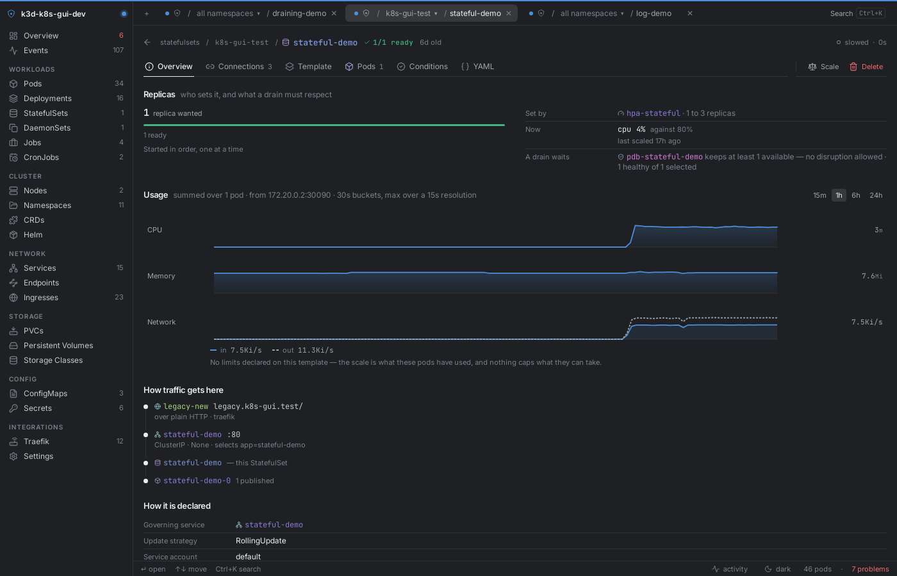
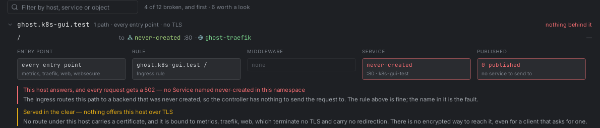
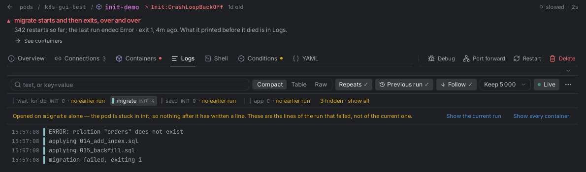
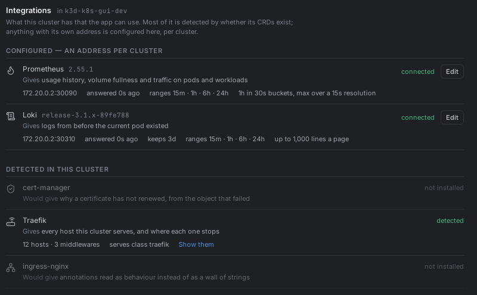
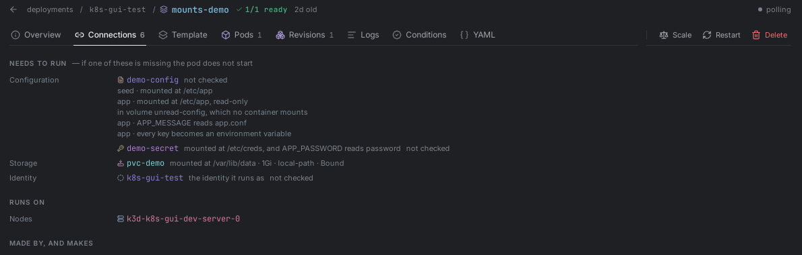
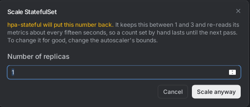
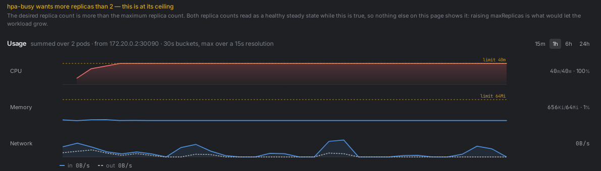
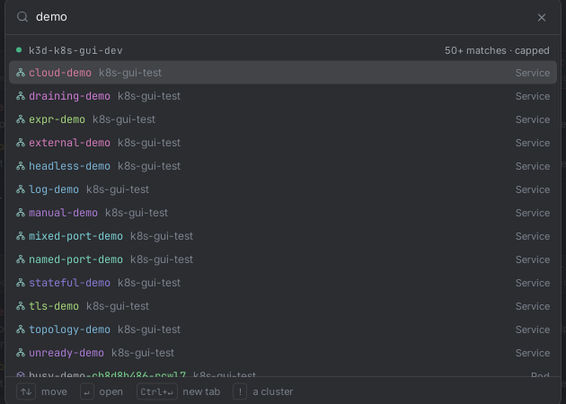
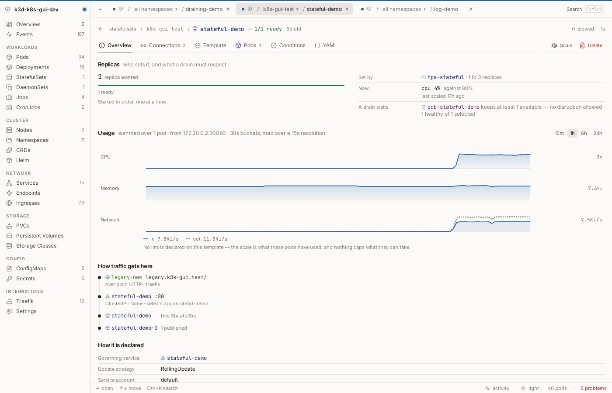

<div align="center">

# Rubick

**A desktop Kubernetes client that tries not to lie to you.**

Like Lens, k9s or Headlamp, it reads your kubeconfig and shows your clusters.<br>
Unlike them, it treats "I don't know" as an answer worth giving.

[](https://github.com/Dudude-bit/rubick/releases/latest)

[](https://github.com/Dudude-bit/rubick/actions/workflows/ci.yml)
[](https://github.com/Dudude-bit/rubick/releases/latest)
[](https://github.com/Dudude-bit/rubick/releases)
[](LICENSE)

Free and GPLv3. No account, no telemetry.

</div>



## Why another one

**It shows the failure, not the field.** A pod whose container is crash-looping reports `Running`, because that is what `.status.phase` holds. A Service with healthy pods and a mistyped port name publishes nothing and still draws green. Rubick derives status the way `kubectl` does and reads the endpoints the cluster actually publishes, so those two stop being invisible.

**It says where the path stops.** Ingress → Service → pods is drawn on the workload's own page, and when nothing is behind an address it names the reason: a backend that does not exist, a selector matching nothing, or pods running but not ready.

**It warns before it obeys.** Scale, Restart, Delete and Edit YAML tell you who will undo the change and how fast — an autoscaler in seconds, Argo CD or Flux in minutes. Then it does what you asked, because a hand edit during an incident is legitimate.

**It says what it cannot see.** A desktop app does not inherit your shell's `PATH`, so a credential plugin that works in your terminal can be invisible here. Settings → Diagnostics names the directories it actually searches, which plugins resolve in them, and what each context needs — and copies the lot, redacted, for when the machine with the problem is not yours.



## What you get

| Area                 | What Rubick shows                                                                                                                                                                       |
| -------------------- | --------------------------------------------------------------------------------------------------------------------------------------------------------------------------------------- |
| **Workloads**        | Pods, Deployments, StatefulSets, DaemonSets, ReplicaSets, Jobs, CronJobs — with init containers as an ordered sequence, sidecars told apart from them, and CPU/memory over time         |
| **Logs**             | Virtualised, multi-container, server-side filtering, repeat collapsing — and they open **where the answer is**: on a pod stuck in init, that means the failing container's previous run |
| **Shell**            | A real tab per pod whose session survives you looking elsewhere                                                                                                                         |
| **Network**          | Services, Ingresses, Endpoints and EndpointSlices, with the traffic chain above                                                                                                         |
| **Storage & config** | PVs, PVCs, StorageClasses, ConfigMaps, Secrets — binary values shown as binary, private keys never revealed                                                                             |
| **Custom resources** | Every CRD, with YAML editing and validation                                                                                                                                             |
| **Helm**             | Releases, revisions, rollback, uninstall                                                                                                                                                |



### Integrations

Detected ones need nothing from you — their CRDs are in the cluster or they are not. Configured ones need an address, and Rubick never goes looking for one.

| Integration       | What it gives you                                                                                                                                                                                               |
| ----------------- | --------------------------------------------------------------------------------------------------------------------------------------------------------------------------------------------------------------- |
| **Routing**       | Traefik, ingress-nginx, Istio — hosts, rules and middleware read as routing. nginx annotations become sentences with the raw key beside each; a `configuration-snippet` is shown verbatim and never paraphrased |
| **Certificates**  | cert-manager — expiry wherever TLS is named, and the issuance chain when renewal fails                                                                                                                          |
| **Delivery**      | Argo CD and Flux — every object says whether it is delivered, from which revision, and whether your edit will survive                                                                                           |
| **Metrics**       | Prometheus — real history, disk fullness and network traffic, none of which `metrics.k8s.io` can answer                                                                                                         |
| **Logs**          | Loki — so a crashed pod's logs outlive the pod                                                                                                                                                                  |
| **Clouds**        | GKE, EKS, AKS node pools, machine types, zones and spot status, read from labels with no cloud account                                                                                                          |
| **Cloud ingress** | GKE Ingress, the AWS Load Balancer Controller and AGIC — the certificate none of them keeps in `spec.tls`, and one row per ALB rather than per Ingress, because `group.name` puts several namespaces on one     |

Adding one costs a folder and a line — see [CONTRIBUTING](CONTRIBUTING.md).

> **AWS and Azure are the least exercised paths here, and issues are very
> welcome.** Rubick is developed against a GKE cluster running Traefik and
> cert-manager, so those are the ones that get looked at every day. The EKS
> and AKS halves — ALB groups, `IngressClassParams`, ACM certificates, AGIC
> annotations, Workload ID — were built from the controllers' documented
> behaviour and covered with unit tests, not against a live cluster of either
> kind. If something reads wrong on yours, that is worth an issue even without
> a diagnosis: paste the objects and say what you expected. Being wrong about
> your cluster is the one thing this app is not allowed to be.



### Getting around

Every name you can go to is a link, with the gestures you expect: click to peek, middle-click for a background tab, shift for a foreground one. Tabs carry a route **and** a scope, so several clusters stay open side by side. Search reaches across clusters — `!cluster-name` aims it. Light and dark, and identity colouring that still works in greyscale or with colour blindness.

<details>
<summary><b>More screenshots</b></summary>
<br>

<table>
<tr>
<td width="50%"><br><b>Connections</b> — grouped by the question you are asking</td>
<td width="50%"><br><b>Before you act</b> — who will undo this, and how fast</td>
</tr>
<tr>
<td><br><b>Usage</b> — the watched window, or real ranges with Prometheus</td>
<td><br><b>Search</b> — across clusters, aimed with <code>!cluster-name</code></td>
</tr>
</table>



**Light theme** — the same page, the same tokens.

</details>

## What it deliberately does not do

- **No cost estimates.** Committed use, sustained use, spot pricing and negotiated rates make them wrong more often than right, and a wrong number about money poisons the right ones.
- **No whole-cluster topology graph.** Routing is a chain in fixed order, not a general graph; a force-directed blob looks like insight and answers nothing.
- **No editing routes or renewing certificates.** Reading them well is a feature; writing them is a different one with a different blast radius — an ACME rate limit is five failures an hour.
- **No guessing.** If a name in a log line might be an object, it stays text. If an integration was never asked, the app says _not looked at_ rather than leaving a gap that reads as _nothing there_.

## Install

Grab the build for your platform from [Releases](https://github.com/Dudude-bit/rubick/releases/latest). There is no Homebrew or winget package yet.

- **macOS** — the app is not signed or notarised yet, so Gatekeeper will refuse the first launch. Right-click the app → **Open**, or `xattr -dr com.apple.quarantine /Applications/Rubick.app`.
- **Windows** — SmartScreen will warn for the same reason. **More info → Run anyway**.
- **Linux** — AppImage and `.deb`.

**What it talks to.** Your clusters, and GitHub for update checks. Nothing else: there is no analytics, no account and no crash reporting, and any integration you connect is an address you typed yourself.

**Requirements.** Kubernetes 1.21+ (EndpointSlices). Cloud login (EKS, GKE, AKS, OIDC, exec plugins) uses the same credentials `kubectl` does; **Settings → Clusters** shows each context, how it authenticates, and what is missing if it cannot.

## Development

```bash
bun install
bun run tauri dev      # run it
bun run tauri build    # package it
```

Needs [Bun](https://bun.sh) 1.2+, Rust 1.91+, and the [Tauri prerequisites](https://tauri.app/start/prerequisites/) for your platform.

```bash
bunx tsc --noEmit                                     # types
bun run lint                                          # eslint, zero warnings
bun run test                                          # frontend tests
cargo test --manifest-path src-tauri/Cargo.toml --lib # Rust tests
```

Three lint rules keep the codebase from drifting back, and each fails the commit: colours must be role tokens, nothing outside `src/integrations/` may name a vendor, and polling rates go through `useLiveQuery` rather than a hand-written interval. [CONTRIBUTING](CONTRIBUTING.md) says why each exists.

Idle polling was measured and cut 77% — from ~895 to ~205 API requests a minute — so leaving the window open does not tax the cluster. A query that has slowed down says so rather than showing a stale number under a live badge.

**Built with** Tauri 2, Rust and [kube-rs](https://kube.rs); React 19, TypeScript, TanStack Query, CodeMirror, xterm.js and Recharts.

## License

GPL-3.0-or-later — see [LICENSE](LICENSE).

Fork it, change it, sell it if you like; ship the source with it. Running the
app is not distribution, so using it — at home or across a company — carries
no obligation at all. Releases up to 3.1.0 were MIT and stay MIT:
[LICENSE-HISTORY.md](LICENSE-HISTORY.md) has the details.
